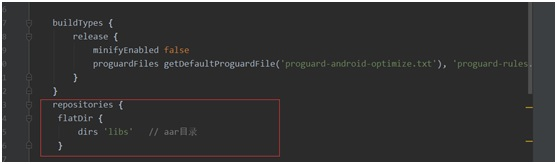
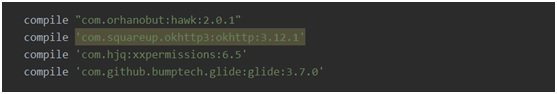
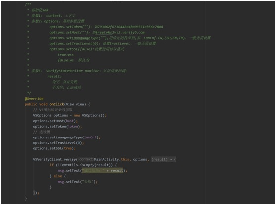

# V5验证-安卓原生SDK使用说明
## 1.添加权限


```xml
<uses-permission android:name="android.permission.INTERNET"/>
<uses-permission android:name="android.permission.READ_PHONE_STATE" />
<uses-permission android:name="android.permission.ACCESS_NETWORK_STATE" />

```
## 2.设置aar引用路径

```
repositories {
	flatDir {
		dirs 'libs'   // aar目录
	}
}
```
## 3.导入aar包到libs目录，并且完成依赖设置


## 4.依赖所需要的库

```
compile "com.orhanobut:hawk:2.0.1"
compile 'com.squareup.okhttp3:okhttp:3.12.1'
compile 'com.hjq:xxpermissions:6.5'
compile 'com.github.bumptech.glide:glide:3.7.0'

```
## 5.添加混淆规则


```
-keep class com.verify5.client.entity.V5JsBinder{*;}
```
## 6.在Application中初始化


## 7.调用

```java
V5VerifyClient.verify(MainActivity.this,options, new VerifyStateMonitor() {
	@Override
	public void onVerifyResult(String result) {
		msg.setText("The result is ："+result);
	 }
});

```


